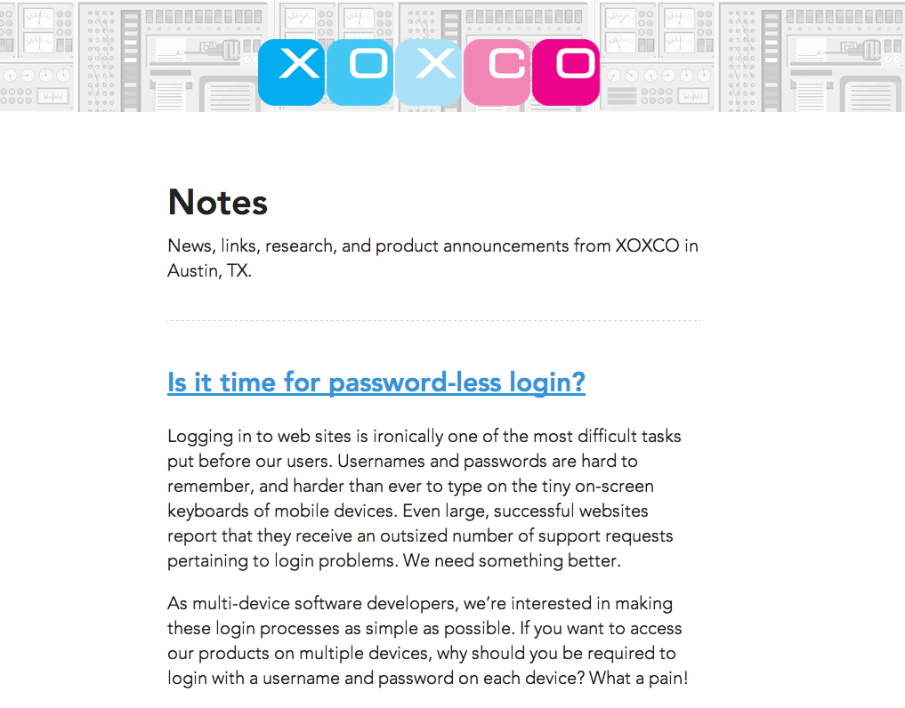
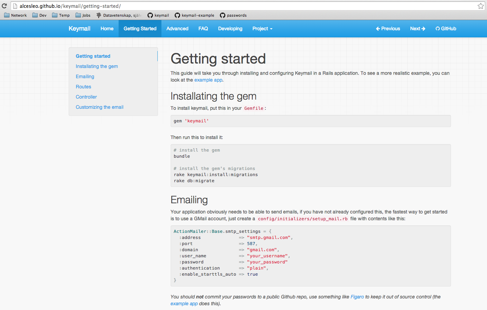

# Keymail

<https://github.com/alcesleo/keymail/>

---

## Where it started

<http://notes.xoxco.com/post/27999787765/is-it-time-for-password-less-login>



---

## Rails

- A plugin that makes it easy

---

## Sample code

```ruby
class SessionsController < ApplicationController

  def request_authentication_email
    Keymail::Authentication.request(params[:email])
  end

  def validate_authentication_link
    result = Keymail::Authentication.verify_url_key(params[:url_key])
    if result.authenticated?
      redirect_to :success
    else
      redirect_to :fail
    end
  end

end
```

---

## Docs

<http://alcesleo.github.io/keymail/>



---

<video data-autoplay src="resources/demo.mov"></video>

---

<http://keymail-example.herokuapp.com/>

<https://github.com/alcesleo/keymail-example>

